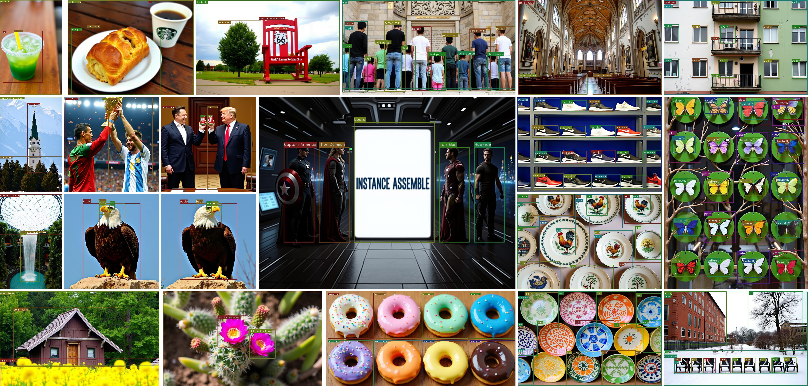

# InstanceAssemble
> Official implementation of "InstanceAssemble: Layout-Aware Image Generation via Instance Assembling Attention" (NeurIPS 2025).

<p align="center">
  
</p>

[](https://arxiv.org/abs/2509.16691)
[](https://huggingface.co/FireRedTeam/InstanceAssemble)
[](https://huggingface.co/datasets/FireRedTeam/DenseLayout)

## Introduction

InstanceAssemble is a lightweight framework for Layout-to-Image generation that enables precise spatial control. We also introduce DenseLayout and Layout Grounding Score (LGS) for rigorous evaluation, where InstanceAssemble achieves state-of-the-art performance on both sparse and dense layouts.

## TODO

- [x] Release **textual control version**.
- [ ] Release **additional-visual control version**.
- [ ] Open-source **training code**.

## Installation

### 1. Environment setup
```bash
git clone https://github.com/FireRedTeam/InstanceAssemble
cd InstanceAssemble
conda create -n instanceassemble python=3.10 -y
conda activate instanceassemble
pip install torch==2.3.0 torchvision==0.18.0 --index-url https://download.pytorch.org/whl/cu121
pip install -r requirements.txt
```

### 2. Weight Download

#### 2.1 Download from HuggingFace
| Model Variant | Link |
|---------------|:----:|
| InstanceAssemble (Textual, SD3)  | [HuggingFace](https://huggingface.co/FireRedTeam/InstanceAssemble/tree/main/sd3) |
| InstanceAssemble (Textual, Flux) | [HuggingFace](https://huggingface.co/FireRedTeam/InstanceAssemble/tree/main/flux) |

You can either download the files manually, or run:
```shell
huggingface-cli download FireRedTeam/InstanceAssemble --local-dir ./pretrained
```

#### 2.2 Directory Setup
All weights should be stored under `./pretrained`.
A correct setup looks like:

```
InstanceAssemble
└── pretrained
    ├── flux
    │   ├── layout.pth
    │   └── pytorch_lora_weights.safetensors
    └── sd3
        ├── layout.pth
        └── pytorch_lora_weights.safetensors
```


## Usage

### Inference
```bash
# sd3 based
python inference.py --model_type sd3 --input_json ./demo/bigchair.json
# flux based
python inference.py --model_type fluxdev --input_json ./demo/bigchair.json
python inference.py --model_type fluxschnell --input_json ./demo/bigchair.json
```

### Streamlit demo
```bash
streamlit run demo.py
```

## DenseLayout and Layout Grounding Score

### 1. Install GroundingDINO
```bash
git clone https://github.com/IDEA-Research/GroundingDINO.git
cd GroundingDINO/
pip install -e .
mkdir weights
cd weights
wget -q https://github.com/IDEA-Research/GroundingDINO/releases/download/v0.1.0-alpha/groundingdino_swint_ogc.pth
```

For more details, please refer to [GroundingDINO](https://github.com/IDEA-Research/GroundingDINO?tab=readme-ov-file#hammer_and_wrench-install).

### 2. Generate Images by DenseLayout
```bash
python generate_dense_benchmark.py --model_type fluxdev --outdir ./output/fluxdev
```

### 3. Compute Layout Grounding Score
```bash
python score_LGS.py --imgdir ./output/fluxdev
```

## Citation

```
@article{xiang2025instanceassemble,
      title={InstanceAssemble: Layout-Aware Image Generation via Instance Assembling Attention}, 
      author={Qiang Xiang and Shuang Sun and Binglei Li and Dejia Song and Huaxia Li and Nemo Chen and Xu Tang and Yao Hu and Junping Zhang},
      journal={arXiv preprint arXiv:2509.16691},
      year={2025},
}
```

## Contact
If you have any questions about the code, please do not hesitate to contact us!
Email: xiangqiang1601@163.com,sunshuang1@xiaohongshu.com

